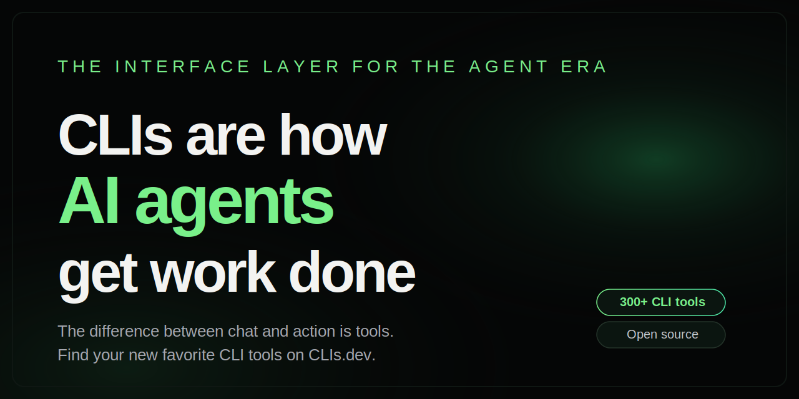

# clis.dev



> **CLIs are the action layer for AI agents.**
> They let agents inspect systems, make changes, and verify the result.

**[clis.dev](https://clis.dev)** · [API](#api) · [Why CLIs?](https://clis.dev/why) · [Submit a CLI](https://github.com/victorcheeney/clis/issues/new?template=submit-cli.yml)

## Why

Agents do not need more dashboards. They need tools.

CLIs are compact, scriptable, composable, and already sit in front of real systems:
GitHub, Kubernetes, cloud providers, databases, CMSs, CI, media pipelines, and business software.

[clis.dev](https://clis.dev) is a directory of those tools, organized so humans and agents can actually find them.

## Stack

Plain PHP + SQLite.

No framework. No build step. Hard cutover deploys.

## Run locally

```bash
php/scripts/apply-runtime.php
cd php
php -S localhost:4322 index.php
```

Runtime DB:

```text
data/clis.sqlite
```

The repo does not ship a database snapshot. `php/scripts/apply-runtime.php` creates the local schema, baseline categories, and a small maintained set of canonical entries.

Optional env:

```bash
export CLIS_ANALYTICS_SALT='random-secret'
export GITHUB_TOKEN='<token>'
```

## API

```bash
curl https://clis.dev/api/clis
curl "https://clis.dev/api/search?q=github%20cli"
curl "https://clis.dev/api/clis?official=1"
curl https://clis.dev/llms.txt
curl https://clis.dev/llms-full.txt
```

## Submit a CLI

Submit missing tools here:

[https://github.com/victorcheeney/clis/issues/new?template=submit-cli.yml](https://github.com/victorcheeney/clis/issues/new?template=submit-cli.yml)

Reviewed manually.

## Contributing

Issues for missing CLIs.
PRs for code/data/docs.

## Security

See [SECURITY.md](SECURITY.md).

## License

MIT
